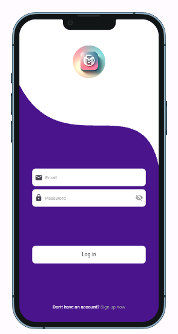

# Monami - E-commerce Flutter Application

<div align="center">
  
  
  [](https://flutter.dev/)
  [](https://dart.dev/)
  [](https://firebase.google.com/)
  [](LICENSE)
</div>

## 📱 Overview

Monami is a comprehensive e-commerce mobile application built with Flutter, showcasing modern development practices and scalable architecture patterns. The app provides a complete shopping experience with social features, user authentication, and robust state management.

## ✨ Key Features

### 🔐 Authentication & User Management
- Secure user registration and login
- Firebase Authentication integration
- User profile management
- Secure data storage with Flutter Secure Storage

### 🛍️ E-commerce Functionality
- **Product Catalog**: Browse products with detailed views
- **Shopping Cart**: Add/remove items with quantity management
- **Favorites**: Save products for later
- **Order Management**: Complete order lifecycle
- **Search & Filter**: Find products quickly

### 🎨 User Experience
- **Responsive Design**: Adapts to various screen sizes
- **Custom Animations**: Smooth Lottie animations
- **Custom Paints**: Beautiful UI components
- **Dark/Light Theme**: Theme customization support

### 📱 Social Features
- **Posts**: Create and share content
- **Comments**: Engage with community
- **Likes**: Express appreciation
- **Media Support**: Image and video uploads

## 🏗️ Architecture

The project follows **Clean Architecture** principles with clear separation of concerns:

```
lib/
├── src/
│   ├── data/           # Data layer (local & remote)
│   ├── features/       # Feature-specific logic
│   ├── presentation/   # UI layer (views, widgets)
│   ├── services/       # Business logic services
│   └── utils/          # Utilities and constants
├── main.dart           # Application entry point
└── app.dart           # App configuration
```

## 🛠️ Tech Stack

### Core Technologies
- **Flutter** - Cross-platform UI framework
- **Dart** - Programming language
- **Riverpod** - State management
- **Firebase** - Backend services

### Key Dependencies
- `firebase_core` - Firebase initialization
- `firebase_auth` - User authentication
- `cloud_firestore` - NoSQL database
- `firebase_storage` - File storage
- `flutter_riverpod` - State management
- `flutter_hooks` - React-like hooks
- `device_preview` - Multi-device testing
- `lottie` - Animations
- `image_picker` - Media selection
- `video_player` - Video playback

## 🚀 Getting Started

### Prerequisites
- Flutter SDK (>=3.0.3)
- Dart SDK
- Firebase project setup
- Android Studio / VS Code
- Git

### Installation

1. **Clone the repository**
   ```bash
   git clone https://github.com/yourusername/monami.git
   cd monami
   ```

2. **Install dependencies**
   ```bash
   flutter pub get
   ```

3. **Firebase Setup**
   - Create a Firebase project
   - Enable Authentication, Firestore, and Storage
   - Download `google-services.json` (Android) and `GoogleService-Info.plist` (iOS)
   - Place them in the respective platform folders

4. **Run the application**
   ```bash
   flutter run
   ```

### Demo Credentials
For testing purposes, use these credentials:
- **Email**: demo@monami.com
- **Password**: demo123

## 📱 Screenshots

<div align="center">
  
  
</div>

## 🧪 Testing

### Code Formatting
```bash
dart format .
```

### Linting
```bash
flutter analyze
```

### Running Tests
```bash
flutter test
```

## 📦 Build & Deployment

### Android
```bash
flutter build apk --release
```

### iOS
```bash
flutter build ios --release
```

### Web
```bash
flutter build web --release
```

## 🤝 Contributing

We welcome contributions! Please follow these steps:

1. Fork the repository
2. Create a feature branch (`git checkout -b feature/amazing-feature`)
3. Commit your changes (`git commit -m 'Add amazing feature'`)
4. Push to the branch (`git push origin feature/amazing-feature`)
5. Open a Pull Request

### Code Style Guidelines
- Follow Dart/Flutter conventions
- Use meaningful variable and function names
- Add comments for complex logic
- Write unit tests for new features

## 📄 License

This project is licensed under the MIT License - see the [LICENSE](LICENSE) file for details.

## 👨‍💻 Author

**Your Name**
- GitHub: [@yourusername](https://github.com/yourusername)
- LinkedIn: [Your LinkedIn](https://linkedin.com/in/yourprofile)
- Email: your.email@example.com

## 🙏 Acknowledgments

- Flutter team for the amazing framework
- Firebase for backend services
- Riverpod team for state management
- Open source community for inspiration

## 📈 Roadmap

- [ ] Payment gateway integration
- [ ] Push notifications
- [ ] Offline support
- [ ] Advanced analytics
- [ ] Multi-language support
- [ ] Admin dashboard

---

<div align="center">
  <p>Made with ❤️ using Flutter</p>
  <p>⭐ Star this repository if you found it helpful!</p>
</div>